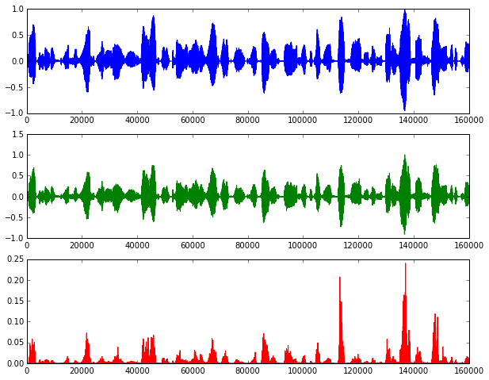

Dictionary Learning and Sparse Coding for Speech Signals 
########################################################

:date: 2014-02-25 17:00
:tags: ift6266
:category: blog
:slug: dictlearning
:author: jfsantos

Sparse signal approximations are the basis for a variety of signal
processing techniques. Such approximations are usually employed with
the objective of having a signal representation that is more
meaningful, malleable, and robust to noise than the ones obtained by
standard transform methods [Sturm2009]_. The so-called dictionary
based methods (DBM) decompose a signal into a linear combination of
waveforms through an approximation technique such as Matching Pursuit
(MP) [Mallat1993]_, Orthogonal Matching Pursuit (OMP) [Pati1993]_, or
basis pursuit [Chen2001]_. The collection of waveforms that can be
selected for the linear combination is called a dictionary. This
dictionary is usually overcomplete, either because it is formed by
merging complete dictionaries or because the waveforms are chosen
arbitrarily (and we have more waveforms than the length of the signal
we want to represent).

Sparse approximation problem formulations
-----------------------------------------

The sparse coding problem is usually formulated either as a
sparsity-constrained problem or as an error-constrained problem. The
formulations are as follows:

Sparsity-constrained:
:math:`\underline{\hat{\gamma}} = \underset{\underline{\gamma}}{arg\,min}\|\underline{x} - D \underline{\gamma}\|_2^2 \quad\text{s.t.}\quad   \|\underline{\gamma}\|_0 \leq K`

Error-constrained:
:math:`\underline{\hat{\gamma}} = \underset{\underline{\gamma}}{arg\,min}\|\underline{\gamma}\|_0 \quad\text{s.t.}\quad \|\underline{x} - D \underline{\gamma}\|_2^2 \leq \epsilon`

In the first one, the idea is that we want to represent the signal by
a linear combination of up to K known waveforms. In the second
formulation, we want the squared error of the representation to be
below a certain threshold. Both formulations are useful, depending on
the problem you are trying to solve: the first one will lead to more
compact representations, while with the second one you can avoid
higher representation errors. 

The second formulation is also useful for applications which need
denoising: consider you have a corrupted version of your signal, and
also that you know (more or less) the signal-to-noise ratio (SNR). If
the noise is very different from the signal you are interested in and
your dictionary is optimized to represent these signals only, it may
be the case that noise is not well represented by the waveforms in
your dictionary. So, you could use the second formulation, setting
:math:`\epsilon` as the estimated noise level, and expect that a good
part of the noise component is not going to be represented in the
sparse approximation.

Dictionary learning
-------------------

Reconstructing a speech signal based on a learned set of segments is not
a new thing. It is done in a well-known technique called vector
quantization (VQ). In VQ, the signal is reconstructed by using only a
single atom (or *codeword*, on the VQ literature jargon) per signal
frame. The dictionary (or *codebook*) is usually designed by a
nearest-neighbor method, which aims to find the codebook that can
reconstruct a signal by using the codewords that have the smaller
distances to the original signal frames while minimizing the residual.
K-means is a codebook learning algorithm for VQ that solves this problem
by dividing the training samples into :math:`K` clusters of the nearest
neighbors of each of the :math:`K` items in the initial codebook. The
codebook is then updated by finding the centroid for each of the
:math:`K` clusters. These steps are ran iteratively until the algorithm
converges to a local minimum solution.

For sparse coding, we want to use multiple atoms to reconstruct the
signal. In the snippet below, we generate a dictionary with 1024
waveforms by using the dictionary learning functions available in
scikit-learn_, which is based on a paper by [Mairal2009]_. The
training data consists of two minutes of audio from the TIMIT
database; sentences were randomly chosen and then split into frames of
256 samples each.

.. _scikit-learn: http://scikit-learn.org

.. code:: python

    # Build the dictionary
    from sklearn.decomposition import MiniBatchDictionaryLearning
    dico = MiniBatchDictionaryLearning(n_components=1024, alpha=1, n_iter=100)
    D = dico.fit(training_data).components_

.. image:: images/dictlearning_5_1.png
   :width: 720px
   :align: center

If we take a look into some of the learned waveforms in the figure
above, we'll see that we have both low-frequency, quasiperiodic
signals (which are probably matching vowels) and signals with more
high-frequency components that look a bit noisy (probably representing
stops/fricatives). 

Reconstructing speech segments using sparse coding with the learned dictionary
------------------------------------------------------------------------------

Now that we have a dictionary which (supposedly) is good for
representing speech signals, let's use Orthogonal Matching Pursuit
(OMP) to reconstruct a speech segment based on a linear combination of
dictionary entries. Let's get 10 seconds of audio from TIMIT (from a
segment of the set that was not in the training set) and reconstruct
it using a sparse approximation. We use the sparsity-based constraint
form, as we are more interested in representing speech in a sparse
way:

.. code:: python

    # Get sample speech segment to reconstruct
    test_data = data[fs*200:fs*210].reshape(fs*10/256, 256)
    
    # Reconstruct it frame-by-frame using a linear combination of 20
    # atoms per frame (sparsity-constrained OMP)
    result = numpy.ndarray((test_data.shape[0],512))
    
    from sklearn.decomposition import SparseCoder
    
    coder = SparseCoder(dictionary = D, transform_n_nonzero_coefs=20, 
                        transform_alpha=None, transform_algorithm="omp")
    
    result = coder.transform(test_data)
    for n in range(result.shape[0]):
        out[n*256:(n+1)*256] = sum(D.T*result[n],axis=1)    

Here are the results: you can listen above the original file and the reconstructed one.

.. raw:: html

   
 Original:  
   <audio controls="controls" >
         <source src="files/orig.ogg" type="audio/wav" />
         Your browser does not support the audio element.
   </audio> 

   
 Reconstructed with 20 atoms/frame: 
   <audio controls="controls" >
         <source src="files/reconst.ogg" type="audio/wav" />
         Your browser does not support the audio element.
   </audio>

These figures show the original signal, the reconstructed one, and the squared error:

While the reconstruction error is low for most of the time considering
we are using only 20 non-zero values per frame to represent the
signal, as opposed to using 256 samples, we can clearly hear the
reconstruction-related artifacts. However, that may be OK if all we
want with the learned dictionary is to have a sparser representation
for speech that will be used later in our synthesizer.

Relationship with our project and next steps
--------------------------------------------

I started working on some experiments comparing the performance of a
sample predictor to two other predictors: one based on LPC
coefficients and the other on a sparse representation of speech. As we
discussed in class, speech has some parameters that change quickly
(source/excitation signal), while others change slowly
(articulation-related). In the first experiments prof. Bengio
suggested, we were working on an MLP-based generative model for
samples without any consideration for phones. His second suggestion
was to design a generative model for the next sample conditioned on
the previous, current, and next phone. 

I started developing generative models based on MLPs for the three
representations above, using one-hot encoded phones and the relative
position in time of the current phone as inputs. For the model based
on LPCs, I am planning to have a separate generative model for the
excitation signal, which is going to work pretty much like the
next-sample predictor we worked on previously; this model could also
be based on the previous, current, and next phone, previous samples,
and things such as pitch/speaker gender. Unfortunately, due to a bug_
in pylearn2 I was not able to get them working yet. Vincent_ said
there's already a `pull request
<https://github.com/lisa-lab/pylearn2/pull/512>`_ which solves this
issue and it seems it will get fixed anytime soon.

.. _bug: https://groups.google.com/forum/#!topic/pylearn-users/EZ3H8xP7gN8
.. _Vincent: http://vdumoulin.github.io/

Last note: you can view the IPython notebook containing all the code used to generate the dictionary and the plots here_, or download_ and run it interactively in your computer.

.. _here: http://nbviewer.ipython.org/urls/seaandsailor.com/files/dictlearning.ipynb
.. _download: files/dictlearning.ipynb

References
----------

.. [Sturm2009] \B. L. Sturm, C. Roads, A. McLeran, and J. J. Shynk, “Analysis, Visualization, and Transformation of Audio Signals Using Dictionary-based Methods†,” Journal of New Music Research, vol. 38, no. 4, pp. 325–341, 2009.

.. [Mallat1993] \S. G. Mallat and Z. Zhang, “Matching pursuits with time-frequency dictionaries,” IEEE Transactions on Signal Processing, vol. 41, no. 12, pp. 3397–3415, Dec. 1993.

.. [Pati1993] \Y. C. Pati, R. Rezaiifar, and P. S. Krishnaprasad, “Orthogonal matching pursuit: Recursive function approximation with applications to wavelet decomposition,” in Signals, Systems and Computers, 1993. 1993 Conference Record of The Twenty-Seventh Asilomar Conference on, 1993, pp. 40–44.

.. [Chen2001] \S. S. Chen, D. L. Donoho, and M. A. Saunders, “Atomic decomposition by basis pursuit,” SIAM journal on scientific computing, vol. 20, no. 1, pp. 33–61, 1998.

.. [Mairal2009] \J. Mairal, F. Bach, J. Ponce, and G. Sapiro, “Online dictionary learning for sparse coding,” in Proceedings of the 26th Annual International Conference on Machine Learning, 2009, pp. 689–696.
