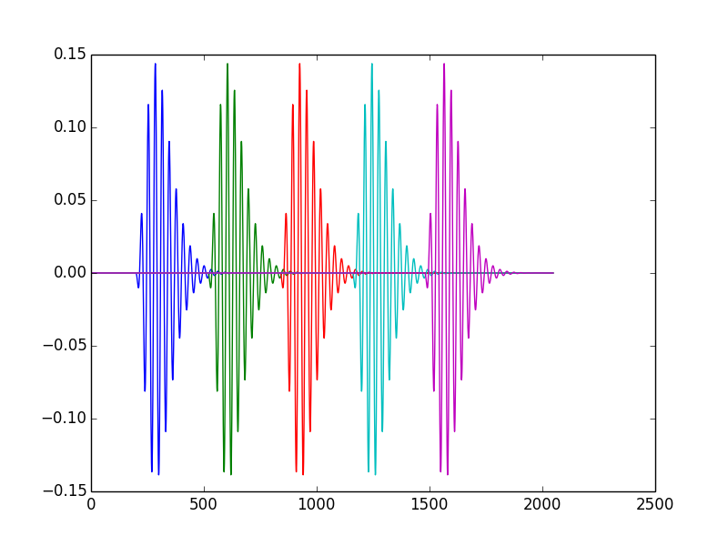
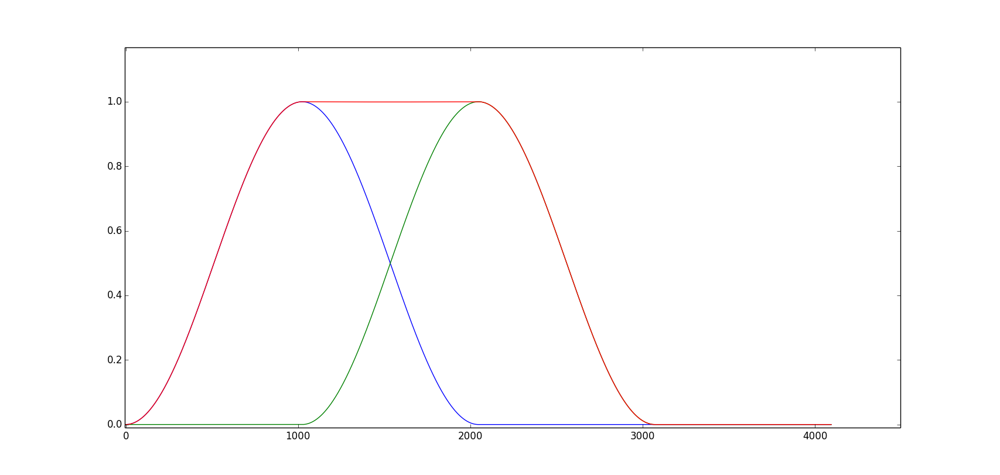
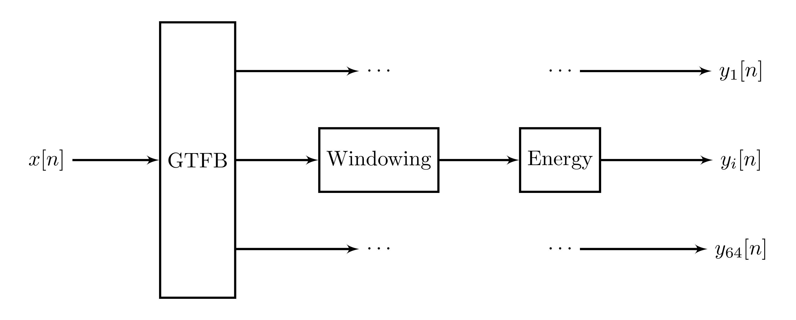
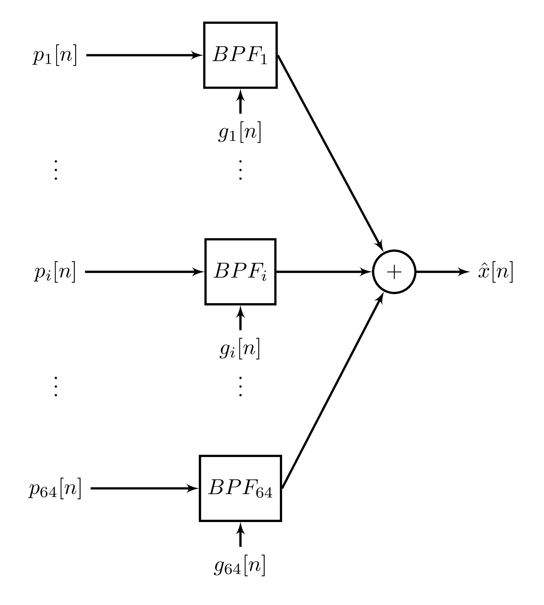

Using an auditory-inspired representation for speech
##############################################################

:date: 2014-03-19 22:00
:tags: ift6266
:category: blog
:slug: gammatone
:author: jfsantos

I `previously <http://www.seaandsailor.com/dict_learning.html>`__
described an approach to representing speech signals by decomposing
them to an arbitrary dictionary (using a sparse coding algorithm such
as Orthogonal Matching Pursuit). In that post, I showed that learning
a representation from the data by using a dictionary learning method
could be useful. However, there were some problems with that
approach. First, the dictionary atoms were not localized in time: the
atoms I learned from the data were waveforms spreading throughout the
entire frame. This behavior has led to issues when reconstructing the
signal, as nothing guarantees the last sample in the :math:`k^{th}`
frame will be close to the first sample in the :math:`k+1^{th}`
frame. The second issue was related to not using overlapped windows to
split/resynthesize the signal. This is one of the main reasons that
made the signals I generated previously so noisy.

In order to solve these problems, I added two updates to my previous
code:

1. Dropping the dictionary I learned from the data and switched to a
   gammatone dictionary.
2. Generating the audio frames using Hamming windows with 50% overlap.

In the next sections, I will give a brief description and motivation
for each of these updates. I will also show why they didn't work as
well as I expected and inspired another architecture.

Gammatone functions and gammatone-based dictionary
--------------------------------------------------

Gammatone filters are a popular way of modeling the auditory
processing at the cochlea. Basically, the cochlea is interpreted as a
filterbank whose impulse response follows the following equation (the
product of a *gamma* function and a cosine, or a *pure tone*):

.. math::
   g(t) = at^{n-1}e^{-2\pi b t}\cos(2 \pi ft + \phi)

In this equation, :math:`b` corresponds to the filter's bandwidth,
:math:`n` is the filter order, :math:`f` is the central frequency, and
:math:`\phi` is the phase of the carrier. The first two parameters can
be fixed for the entire filterbank, while the center frequencies
:math:`f` are usually defined according to the cochlea's critical
frequencies. One way of computing these frequencies is by using the
Equivalent Rectangular Bandwidth (ERB), which gives an approximation
to the bandwidths of the human auditory filters:

.. math::
   ERB_j = \frac{f_j}{Q_{ear}} + B_{min}

Here, :math:`Q_{ear} = 9.26449` and :math:`B_{min} = 24.7` are
constants corresponding to the Q factor and minimum bandwidth of human
auditory filters.

Gammatone functions are used in auditory modelling because they match
the resonance of different regions in the cochlea. As shown in
[Smith2006]_, human speech can be sparsely represented by gammatone
atoms. [Strahl2008]_ has later shown that a sparse gammatone model can
be optimized for English speech, even though the optimized model does
not match the human auditory filters anymore.

A gammatone dictionary can be built similarly to a Gabor dictionary,
as gammatones are localized both in time and frequency. First, we have
to choose a set of frequencies; usually, you pick the number of
frequencies you want and the range, and use the ERB equation to find
equally-spaced frequencies in the ERB space (these would be the so
called critical frequencies). Then, we select the resolution of our
atoms (which has to be less or equal to the frame length in our
application) and then time-shift the atoms inside the frame by a
specified amount. The following Python code does that (and also
normalizes the dictionary at the end):

.. code:: python

   def gammatone_matrix(b, fc, resolution, step):
       """Dictionary of gammatone functions"""
        centers = np.arange(0, resolution - step, step)
        D = np.empty((len(centers), resolution))
        for i, center in enumerate(centers):
            D[i] = gammatone_function(resolution, fc, center, b=b)
        D /= np.sqrt(np.sum(D ** 2, axis=1))[:, np.newaxis]
        return D

For illustration, see below 5 time-shifted versions of the same
gammatone (note that in the actual dictionary, we probably want the
time-shifted atoms to overlap a bit more than in this figure).

See my gammatone sparse coding library here_, and an updated version
of my IPython notebook for sparse coding there_ for more details. The
test code in the library reads a wave file, segments it in 2048 frames
with 50% overlap, windows each frame with a Hanning window (see next
section for details) and decomposes each frame using gammatone
atoms. The reconstruction in this example uses 200 non-zero
coefficients per frame and the dictionary has 3150 atoms. This amounts
for a compression of more than 10 times, but the reconstruction does
not sound as bad as the ones we've seen previously.

.. _here: https://github.com/jfsantos/ift6266h14/blob/master/sparse_coding/sparse_coding_gammatone.py
.. _there: https://github.com/jfsantos/ift6266h14/blob/master/sparse_coding/Sparse%20coding%20with%20a%20multiscale%20Gammatone%20dictionary.ipynb

Overlapping windows
-------------------

A window function is a function that has non-zero values only inside a
given interval. The most classical example of it is the rectangular
window:

.. math::
   w_{rect}[n] = \begin{cases} 1, \mbox{if } n_0 \leq n \leq n_f \\
   0, \mbox{ otherwise} \end{cases}

However, a problem with the rectangular window is that it does nothing
to smooth the signal at the window borders. If we are processing a
signal on a per-frame basis and then reconstructing it by
concatenating the processed frames, nothing guarantees continuity when
we join the processed frames. These abrupt changes introduce broadband
noise bursts in our signal, which is something that we probably do not
want!

A way to mitigate this problem is to do `overlap-add`_
synthesis. Instead of shifting a full frame at a time and using
rectangular windows, we overlap frames by a certain amount (25%, 50%,
and 75% are often used values) and multiply each frame by a smooth
window. We use window functions in such a way that the overlapped
windows always sum to unity. The figure below shows two `Hamming
windows`_ with an overlap of 50% (blue and green curves), and the sum
of both windows (red curve). If we keep overlapping windows like this,
overlap-add is an identity operation (i.e., we do not change the final
result as long as we do not process the frames). Of course, in our
case we are processing the frames, but overlap-add will help a bit in
mitigating the abrupt changes between frames as we are now summing the
values in overlapping frames to reconstruct our output instead of just
connecting two non-overlapping frames.

.. _overlap-add: https://ccrma.stanford.edu/~jos/parshl/Overlap_Add_Synthesis.html
.. _Hamming windows: https://ccrma.stanford.edu/~jos/sasp/Hamming_Window.html

Experiment with sparse coding using gammatone atoms
---------------------------------------------------

Based on the ideas described above, I generated a sparse-coded version
of the TIMIT dataset using my gammatone sparse coding library. I used
gammatones with 50 different cosine frequencies between 50 and 8000
Hz, timeshifts of 8 samples, and frames of length 160 with 50%
overlap. For each frame, a sparse representation using 16 non-zero
coefficients was extracted by using Orthogonal Matching Pursuit with a
sparsity constraint.

This data and the one-hot encoded information about the previous,
current, and next phone were used to train an MLP with the following
characteristics:

- Two rectified linear hidden layers (2150 and 950 units, respectively);
- Linear output layer with 950 units (one for each sparse coding coefficient);
- Training: batch gradient descent (batch size of 512 samples), with squared error objective;
- Termination criteria: 10 epochs with objective decrease lower than
  :math:`10^{-6}` or 200 epochs.

However, something strange happened when I tried to train this
network: it has converged after 10 epochs! Of course this would be too
good to be true, which means something terrible happened instead. In
my case, the training, testing, and validation objectives did not
change at all with training iterations. I still do not know exactly
what happened, but I suspect the large amount of zeros in the input
and target values made the majority of the gradients equal to zero,
and without gradients none of the weights will change. Maybe a
different kind of initialization could solve this issue, but there are
other problems as well. Namely, this network does nothing to enforce
sparsity at the output, and in the end the output coefficients will
have a distribution that is very different from the target
coefficients (which are zero most of the time). Prof. Bengio suggested
that I could try making the output distribution the product of a
Bernoulli distribution and a Gaussian distribution: the first one
would say if that coefficient should be zero or not, and the latter
would give its value. However, he noted that this is just an arbitrary
statistical model which probably does not correspond to the real
behavior of the coefficients, and we would probably be better by
trying to estimate this distribution too (maybe with an RBM).

While trying to solve these issues, I had an idea for another
architecture that could be easier to implement...

Splitting signal into spectral envelope and phase
-------------------------------------------------

As `Jessica`_ pointed out in her blog, most of the relevant
information in a speech signal is encoded in its envelope. Because of
that, we are less sensitive to phase distortions than to envelope
distortions. As we have already discussed in class, as speech envelope
variations are slower than the phase variations, some speech coding
models (such as LPC) take these facts into account by encoding the
envelope and the phase separately (and usually using a simpler model
for the phase than for envelopes).

.. _Jessica: http://ift6266speechsynthesisjt.wordpress.com/2014/03/19/randomized-phases-preserves-speech-content-and-identity/

It was also brought to my attention that a recent paper [Han2014]_ to
be presented at this year's ICASSP uses gammatone filterbank features
to find spectral masks to use in speech dereverberation. The advantage
of using gammatone filterbanks instead of a simple STFT is that with
the gammatone filterbank, we are able to fine-tune spectral resolution
at lower frequency bands (the most important band for speech
content). While speech dereverberation is a totally different topic,
the feature space used in that paper is still relevant. They are
looking for spectral masks to filter an existing signal and not on
synthesis, so they can discard the phase completely. For our project,
we cannot do that but we could work with a slightly different
approach.

We have one network that is trained on spectral envelopes, using a
similar approach to that of the paper. This network is trained using
the gammatonegram, which consists of the total gammatone band energy
in all channels of our filterbank per frame. The figure below depicts
how this is done:

Here, :math:`y_i[n], i = 1, \dots, 64` are the frame energies (sum of
squared samples) for each gammatone channel (I'm using 64 channels
here as this is what was used in [Han2014]_ and can be a good starting
point). As inputs of this network, we would use the gammatonegram of a
number of previous frames, one-hot encoded phones for these frames
(and possibly some of the next frames), and the output would be the
gammatonegram of the next frame. This is not enough to resynthesize a
speech signal as we don't have the phase, but that could be solved by
training a separate model for phases, either for an overall phase or a
per-channel phase. Resynthesis is done according to the following
signal flow diagram:

Here, :math:`p_i[n], i=1, \dots, 64` are vectors representing the
phase of each channel and :math:`g_i[n], i=1, \dots, 64` are the
amplitudes for each gammatone channel (which could be either the
:math:`y_i[n]` values computed before for each frame or a smoothed
version of them).

For the network architecture, I am planning on using an MLP (possibly
with unsupervised pretraining) for the spectral envelopes. For the
phase components, I will initially try RBMs using previous phase
samples, phone codes, and speaker characteristics (pitch, gender,
etc.) as input. I expect to be able to use simpler models for the
phase (or at least be able to control this model's complexity, as I
believe there should be a tradeoff between speech quality and the
accuracy of the phase models). I have already extracted the gammatone
features from the whole database and will report results for the
spectral envelope model on my next post.

References
----------

.. [Smith2006] \E. C. Smith and M. S. Lewicki, “Efficient auditory coding,” Nature, vol. 439, no. 7079, pp. 978–982, 2006.

.. [Strahl2008] \S. Strahl and A. Mertins, “Sparse gammatone signal model optimized for English speech does not match the human auditory filters,” Brain research, vol. 1220, pp. 224–233, 2008.

.. [Han2014] \K. Han, Y. Wang, D. Wang, “Learning spectral mapping for speech dereverberation”, To appear in the Proceedings of the IEEE ICASSP 2014, 2014. Available at http://www.cse.ohio-state.edu/~dwang/papers/HWW.icassp14.pdf.
