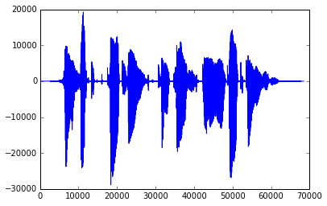

Speech signal representations
#############################

:date: 2014-02-01 18:00
:tags: ift6266
:category: blog
:slug: initial_representation
:author: jfsantos

One of the objectives of our project is to learn a useful
representation from speech signals that can be used to synthesize new
(arbitrary) sentences. There are many different ways of representing
speech signals; those representations are usually tailored to specific
applications. In speech recognition, for example, we want to minimize
the variability from different speakers while keeping sufficient
information to discriminate different phonemes. In speech coding,
however, we usually want to keep information that is associated with
the speaker's identity as well as reduce the amount of data to be
stored/transmitted.

Our dataset was initially distributed as frame MFCCs (input) and
one-hot encoded phonemes (labels). While this representation is
usually enough for speech recognition, I believe it is not enough for
learning a useful representation for synthesis (as briefly mentioned
by Laurent Dinh in his `post`_). The reason is that MFCCs are a
destructive/lossy representation of a speech signal. First,
fundamental frequency information is completely lost, as well as
instantaneous phase. MFCCs more or less represent the energy in
different frequency channels that are considered important for human
speech (following the Mel scale [Stevens2005]_).

.. _post:
   http://deeprandommumbling.wordpress.com/2014/01/29/listening-to-a-vector

In this post, I will present some alternative speech signal
representations that may be more suitable for speech synthesis. Even
though one of our objectives is to learn a representation, we need to
understand a little bit about what has been developed by the speech
processing community, as it can serve as an inspiration.

Acoustic samples (time domain)
------------------------------

Using raw acoustic samples from overlapping frames is the simplest
approach. A discrete signal :math:`x[n]` is simply a sequence of (real
or integer) numbers corresponding to the signal samples (sampled
uniformly at an arbitrary sampling rate). The usual sampling rate for
speech recognition applications is 16 kHz, while the sampling rate
used for "telephone speech" coding is 8 kHz. This is essentially the
information we find in a PCM-encoded WAV file.

.. add plots

   *Time-domain speech signal sampled at 16 kHz.*

.. figure:: images/timedomain_zoom.png
   :align: center

   *Zoom of a 200-sample segment of the above signal.*

Short-time Fourier Transform
----------------------------

Another possible representation is to use Short-time Fourier Transform
(STFT) coefficients from overlapping frames. This is essentially the
same as using raw acoustic samples in the sense that there is no
information loss, but the representation in the frequency domain is
usually clearer for humans because we can associate the content in
different frequency bands with different phonemes. The STFT of a
discrete signal :math:`x[n]` is given by:

.. math::
   STFT{x[n]}(m,\omega) = X(m,\omega) = \sum_{n=-\infty}^{\infty} x[n] w[n-m] e^{-j \omega n}

where :math:`n,\omega` are the time and frequency indexes, and
:math:`w[n]` is the windowing function. A spectrogram is the
magnitude-squared version of this equation (i.e., without phase
information).

Spectrograms can be done using windows with different lengths. This is
related to the `Gabor (or Heisenberg-Gabor)`_ limit: we cannot
simultaneously localize a signal in both time and frequency domains
with a high degree of certainty. Therefore, we usually have to use
different window lengths depending on what we want to analyze: wide
windows have better frequency resolution and bad time resolution,
while the opposite happens for short windows. A possible compromise is
to choose a single window length that has sufficient resolution for
the target application.

.. _`Gabor (or Heisenberg-Gabor)`:
   http://en.wikipedia.org/wiki/Short-time_Fourier_transform#Resolution_issues

.. figure:: images/specgram.png 
   :align: center

   *Spectrogram (using a 20 ms rectangular window) of the speech signal above.*

Linear Predictive Coding
------------------------

Linear Predictive Coding [o1988linear]_ coefficients + residual
(basically excitation information). LPC is based on the source-filter
model of speech production, which assumes a speech signal is produced
by filtering a series of pulses (and eventually noise bursts). The LPC
coefficients are related to the position of the articulators in the
mouth (e.g., tongue, palate, lips), while the pitch/noise information
is related to how the vocal tract is excited. This is usually
represented as an auto-regressive (AR) model with order :math:`p`:

.. math::
   x[n] = \sum_{k=1}^{p} a_k x[n-k]

where :math:`a[k]` are the model's coefficients. LPCs are computed for each speech frame based on a least-squares method:

.. math::
   \arg\min_{a_k} \sum_{-\infty}^\infty [x[n] - \sum_{k=1}^p a_k x[n-k]]^2

Because of its error criteria, LPC also has problems to represent the
phase of acoustic signals (by squaring the error, we are modeling the
spectral magnitude of the signal, and not the phase). For this reason,
LPC speech may sound artificial when resynthesized. More robust
methods are used nowadays, such as the code-excited linear prediction
(CELP) [valin2006speex]_. These methods, for example, use
psychoacoustics-inspired techniques to shape the coding noise to
frequency regions where the human auditory system is more tolerant. In
CELP, the residual is not transmitted directly, but represented as
entries in two codebooks.

Wavelets
--------

Them main purpose of a wavelet transform is to decompose arbitrary
signals into localized contributions that can be labelled by a scale
(or resolution) parameter [mallat1989theory]_. The representation
achieved through the wavelet transform can be seen as hierarchical: at
a coarse resolution, we have an idea of “context”, while with highest
resolution we can see more details. This is achieved by decomposing
the original signal using a set of functions well-localized both in
time and frequency (the so-called wavelets).

Discrete wavelet transforms are implemented as a cascade of digital
filters with transfer functions derived from a discrete "mother
wavelet". The figure below shows an example. Check also the notebook_
for an example of wavelet decomposition of the audio signal shown
above.

.. figure:: images/Wavelets_-_Filter_Bank.png
   :align: center

   *Filter bank used by a discrete wavelet transform with 3 levels of decomposition (image from the* `WikiMedia Commons`_ *)*.

.. _`WikiMedia Commons`:
   http://en.wikipedia.org/wiki/File:Wavelets_-_Filter_Bank.png

Sparse coding and dictionary-based methods
------------------------------------------

Sparse signal approximations are the basis for a variety of signal
processing techniques. Such approximations are usually employed with
the objective of having a signal representation that is more
meaningful, malleable, and robust to noise than the ones obtained by
standard transform methods [Sturm]_. The so-called
dictionary-based methods (DBM) decompose a signal into a linear
combination of waveforms through an approximation technique such as
Matching Pursuit (MP) [Mallat1993]_ or Orthogonal Matching Pursuit
(OMP) [Pati1993]_. The collection of waveforms that can be
selected for the linear combination is called a dictionary. This
dictionary is usually overcomplete, either because it is formed by
merging complete dictionaries or because the functions are chosen
arbitrarily.

I will talk more about sparse coding and dictionary-based methods
later, since sparse coding is one of the methods we'll see in the
course.

.. _notebook: 

IPython notebook
----------------

An IPython notebook with examples for all the representations
described here (except sparse coding) is available on my `GitHub
repo`_. You will need to install the packages `PyWavelets`_ and
`scikits.talkbox`_ (both are available at PyPI) to be able to run it. If you just want to take a look without interacting with the code, you can access it `here`_.

.. _`GitHub repo`: https://github.com/jfsantos/ift6266h14
.. _`PyWavelets`: http://www.pybytes.com/pywavelets/
.. _`scikits.talkbox`: https://github.com/cournape/talkbox
.. _`here`: http://nbviewer.ipython.org/github/jfsantos/ift6266h14/blob/master/notebooks/Speech%20representation%20examples.ipynb

References
----------

.. [Stevens2005] \S. S. Stevens, J. Volkmann, and E. B. Newman, “A Scale for the Measurement of the Psychological Magnitude Pitch,” The Journal of the Acoustical Society of America, vol. 8, no. 3, pp. 185–190, Jun. 2005.

.. [o1988linear] \D. O’Shaughnessy, “Linear predictive coding,” IEEE Potentials, vol. 7, no. 1, pp. 29–32, Feb. 1988.

.. [valin2006speex] \J.-M. Valin, “Speex: a free codec for free speech,” in Australian National Linux Conference, Dunedin, New Zealand, 2006.

.. [mallat1989theory] \S. G. Mallat, “A theory for multiresolution signal decomposition: the wavelet representation,” Pattern Analysis and Machine Intelligence, IEEE Transactions on, vol. 11, no. 7, pp. 674–693, 1989.

.. [Sturm] \B. L. Sturm, C. Roads, A. McLeran, and J. J. Shynk, “Analysis, Visualization, and Transformation of Audio Signals Using Dictionary-based Methods†,” Journal of New Music Research, vol. 38, no. 4, pp. 325–341, 2009.

.. [Mallat1993] \S. G. Mallat and Z. Zhang, “Matching pursuits with time-frequency dictionaries,” IEEE Transactions on Signal Processing, vol. 41, no. 12, pp. 3397–3415, Dec. 1993.

.. [Pati1993] \Y. C. Pati, R. Rezaiifar, and P. S. Krishnaprasad, “Orthogonal matching pursuit: Recursive function approximation with applications to wavelet decomposition,” in Signals, Systems and Computers, 1993. 1993 Conference Record of The Twenty-Seventh Asilomar Conference on, 1993, pp. 40–44.
